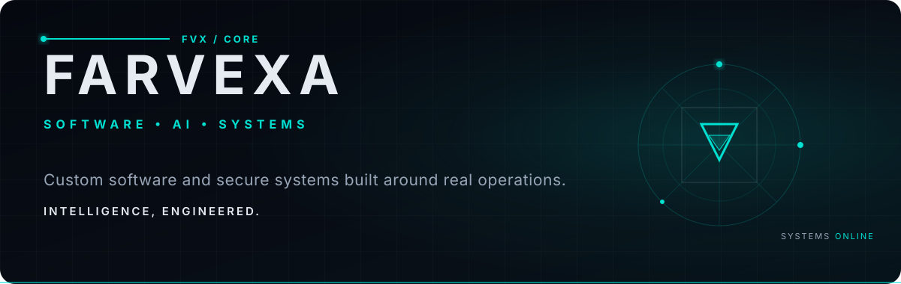
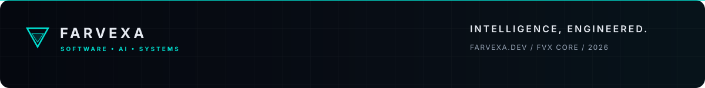

<div align="center">

<a href="https://farvexa.dev">
  
</a>

<br />

[](https://farvexa.dev)
[](https://farvexa.dev/en/services)
[](https://farvexa.dev/en/contact)

</div>

<br />

## `FVX / PROFILE`

### Custom software and secure systems built around real operations.

I’m **Farhang Fatih**, a software engineer and security researcher from Kurdistan, Iraq. I design, engineer, secure, and deploy custom software, ERP platforms, web applications, mobile products, AI integrations, and business automation.

My work now lives under **FARVEXA** — an engineering practice focused on dependable architecture, useful intelligence, and software shaped around the way organizations actually work.

```text
OPERATOR      Farhang Fatih
FOCUS         Software · AI · Systems · Security
LOCATION      Kurdistan, Iraq
ENVIRONMENT   Linux-native
STATUS        Building production systems
```

---

## `01 / ENGINEERING CAPABILITIES`

| System | What I build |
|:--|:--|
| **Custom Software** | Purpose-built business systems, dashboards, integrations, and workflows designed around real operations. |
| **Enterprise & ERP** | Modular systems connecting administration, HR, finance, inventory, documents, reporting, and permissions. |
| **Web Platforms** | Fast, accessible websites and serious web applications with dependable architecture. |
| **Mobile Products** | Mobile and progressive web applications shaped around user context and real tasks. |
| **AI Systems** | Assistants, document processing, knowledge search, extraction, classification, and governed reporting. |
| **Automation** | API-driven workflows, internal tools, scheduled processes, notifications, and repetitive work reduced safely. |

---

## `02 / SELECTED SYSTEMS`

<table>
<tr>
<td width="50%" valign="top">

### AxiomBreak AI

Linux-native cybersecurity AI workspace connecting 340+ models through a custom orchestration layer.

`Python` `Linux` `AI orchestration` `Security research`

</td>
<td width="50%" valign="top">

### [Pentesting Platform](https://github.com/MrGuevar4/Pentesting_Platform)

A unified bug-bounty dashboard with 44+ automated scanners, asynchronous execution, and structured reporting.

`FastAPI` `React` `Python` `AppSec`

</td>
</tr>
<tr>
<td width="50%" valign="top">

### [SkySpy Kurdistan](https://github.com/MrGuevar4/SkySpy-Kurdistan)

Open-source intelligence and passive RF/Wi-Fi monitoring for real-time UAV detection and alerting.

`Python` `ESP32` `RF intelligence` `KML`

</td>
<td width="50%" valign="top">

### [ONE Cafe POS](https://github.com/MrGuevar4/One_Cafe_PS)

A Kurdish-first, offline-capable point-of-sale system with RTL interfaces and automated print routing.

`React` `TypeScript` `Bun` `Local-first`

</td>
</tr>
<tr>
<td width="50%" valign="top">

### [Ratil — رتیل](https://github.com/MrGuevar4/Ratil)

An offline-first Quran companion with 114 surahs, Tajweed highlighting, multilingual translation, and 14+ reciters.

`Flutter` `Dart` `Offline-first` `RTL`

</td>
<td width="50%" valign="top">

### FARVEXA Lab

Open experiments, engineering tools, security research, and practical prototypes from ongoing technical work.

[Explore the lab →](https://farvexa.dev/en/lab)

</td>
</tr>
</table>

---

## `03 / SYSTEM ARCHITECTURE`

<div align="center">

| 01 — DISCOVER | 02 — ARCHITECT | 03 — DESIGN | 04 — ENGINEER |
|:--:|:--:|:--:|:--:|
| Operations and constraints | Data, APIs and permissions | Interfaces around real work | Frontend, backend and automation |

| 05 — SECURE | 06 — DEPLOY | 07 — EVOLVE |
|:--:|:--:|:--:|
| Validate access and attack surfaces | Build a dependable delivery path | Monitor, optimize and extend |

</div>

---

## `04 / TECHNOLOGY`

<div align="center">


</div>

> Technology supports the architecture. It is never the identity of the work.

---

## `05 / SECURITY BY DESIGN`

Security is part of the architecture from the first technical decision—not an addition after launch.

```text
LEAST PRIVILEGE    AUTHORIZATION    INPUT VALIDATION    RATE LIMITING
AUDITABILITY       SECRET HYGIENE   DEPENDENCY REVIEW   RECOVERY PATHS
```

My security background includes web and API penetration testing, malware analysis, reverse engineering, cloud hardening, network assessment, and secure full-stack development. I apply that experience defensively: clear trust boundaries, granular access, validated inputs, observable systems, and maintainable delivery.

[Review FARVEXA engineering standards →](https://farvexa.dev/en/security)

---

## `06 / CREDENTIALS`

- Certified Cloud Security Practitioner — AWS
- Certified AppSec Practitioner (CAP) — The SecOps Group
- Certified AppSec Pentesting Expert (CAPenX) — The SecOps Group
- Certified Network Security Practitioner (CNSP) — The SecOps Group
- Google Cybersecurity Certificate · Google AI Certificate
- Information Technology — Raparin Technical and Vocational Institute, 2024–2026

---

## `07 / SIGNAL`

<div align="center">


<br /><br />


</div>

---

<div align="center">

### Have a system in mind?

Tell FARVEXA what needs to work better. We’ll turn the requirements into architecture, software, and a path to production.

[](https://farvexa.dev/en/contact)

<br /><br />



</div>
